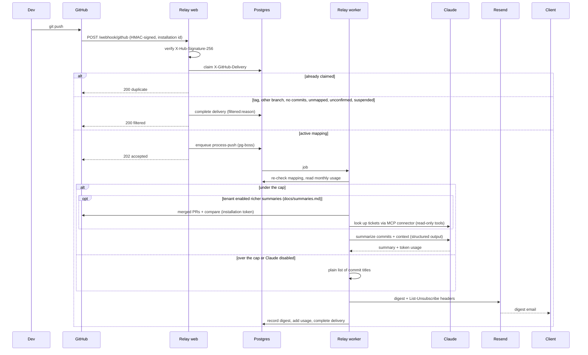

# Sequence diagram

The push flow end to end, matching `spec/openapi.yaml` and
`spec/webhook-contract.md`. `Dev` is only the trigger.

```mermaid
sequenceDiagram
    participant Dev
    participant GitHub
    participant Web as Relay web
    participant DB as Postgres
    participant Worker as Relay worker
    participant Claude
    participant Resend
    participant Client

    Dev->>GitHub: git push
    GitHub->>Web: POST /webhook/github (HMAC-signed, installation id)
    Web->>Web: verify X-Hub-Signature-256
    Web->>DB: claim X-GitHub-Delivery
    alt already claimed
        Web-->>GitHub: 200 duplicate
    else tag, other branch, no commits, unmapped, unconfirmed, suspended
        Web->>DB: complete delivery (filtered:reason)
        Web-->>GitHub: 200 filtered
    else active mapping
        Web->>DB: enqueue process-push (pg-boss)
        Web-->>GitHub: 202 accepted
        DB->>Worker: job
        Worker->>DB: re-check mapping, read monthly usage
        alt under the cap
        opt tenant enabled richer summaries (docs/summaries.md)
        Worker->>GitHub: merged PRs + compare (installation token)
        Worker->>Claude: look up tickets via MCP connector (read-only tools)
        end
        Worker->>Claude: summarize commits + context (structured output)
        Claude-->>Worker: summary + token usage
        else over the cap or Claude disabled
            Worker->>Worker: plain list of commit titles
        end
        Worker->>Resend: digest + List-Unsubscribe headers
        Resend-->>Client: digest email
        Worker->>DB: record digest, add usage, complete delivery
    end
```